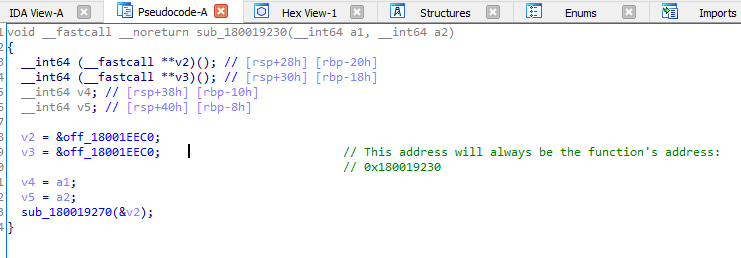
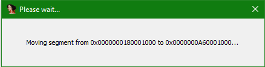
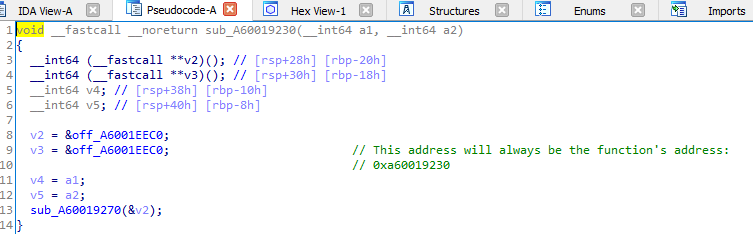

# Rebased Comment
This plugin rebases comments when you rebase your IDA database.

The plugin will search for hexadecimal numbers that are within range of your program's segments, and fix your comments after every rebase.

Targeting support for IDA 7.0+.

## Installing
Copy `rebased_comment.py` to either `%IDA_INSTALL_DIR%\plugins` or to `%AppData%\Hex-Rays\IDA Pro\plugins`

<table>
    <tr>
        <td>

        </td>
        <td>

        </td>
        <td>

        </td>
    </tr>
</table>
